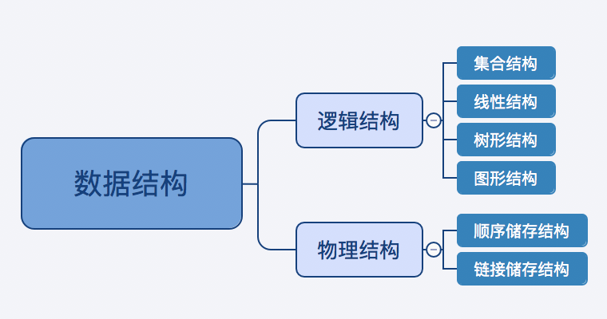
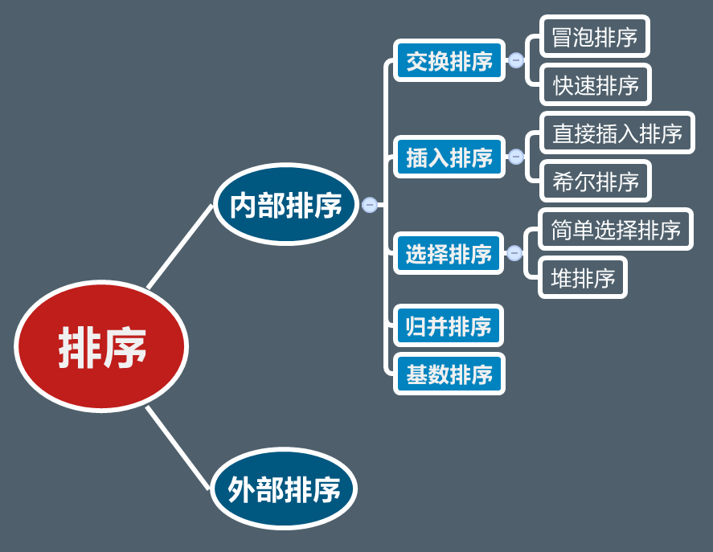

#一、基本概念
##1.什么是数据结构
数据结构：数据结构就是数据之间的组织形式。
##2.数据结构的分类

##3.什么是程序
指令的集合
程序=数据结构+算法
##4.五大经典算法
分治法、回溯法、动态规划、贪心算法、分支定界法
#二、数据结构
1. 顺序表
2. 单链表、循环单链表、双链表、循环双链表
3. 堆栈
4. 队列
5. 二叉树
6. 图
7. 字符串

#三、算法
##1.查找
线性表的查找
树表的查找
哈希表的查找
##2.排序

1. 冒泡排序
2. 快速排序
3. 直接插入排序
4. 希尔排序
5. 简单选择排序
6. 堆排序
7. 归并排序
8. 基数排序

http://www.cnblogs.com/jingmoxukong/p/4302718.html
